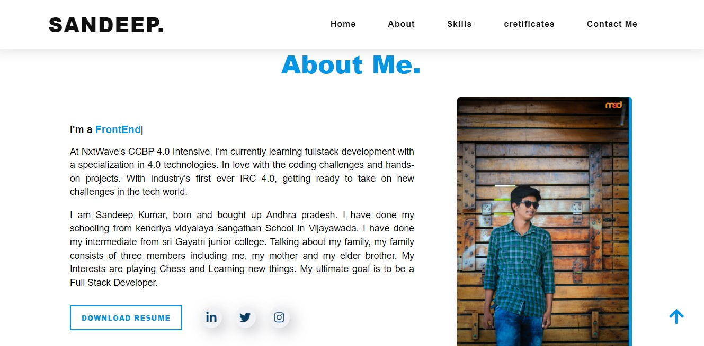

 

I am Sandeep Kumar, born and bought up Andhra pradesh. I have done my schooling from kendriya vidyalaya sangathan School in Vijayawada. I have done my intermediate from sri Gayatri junior college. Talking about my family, my family consists of three members including me, my mother and my elder brother. My Interests are playing Chess and Learning new things. My ultimate goal is to be a Full Stack Developer.

 

## Features 🧯

<!-- * 🔥 Blog Pages and single blog page included  -->
* 🔥 Clean and Professional Design 
* 🔥 100% Responsive 
* 🔥 Pixel Perfect 
* 🔥 Clean and commented code 
* 🔥 W3C Valid HTML5 & CSS3 
* 🔥 Stylish Social Links 
* 🔥 Free Fonts from Google Fonts 
* 🔥 Free Icons from Font Awesome 
* 🔥 Crossover Browsers Compatibility 
* 🔥 Detailed documentation 
* 🔥 Easy Customization 
* 🔥 Free Future Updates 
* 🔥 Ready-made real content (No lorem ipsum) 
* 🔥 Cross Browser Compatible 
* 🔥 Friendly 5 stars Support 24/7
* 🔥 Working Contact form
* 🔥 And many More….

 

 
 

## Sources and Credits 👨‍🚀👨‍💻🎅
* [jQuery](https://jquery.org/)
* [Magnific-popup](http://dimsemenov.com/plugins/magnific-popup/)
* [Typed-js](https://github.com/mattboldt/typed.js/)

 
 

## Fonts Used 🏴‍☠️🏴🏳🏳‍🌈
1) [Crimson Text](https://fonts.google.com/specimen/Crimson+Text?query=Crimson+Text)
2) [Nunito](https://fonts.google.com/specimen/Nunito?query=Nunito)

 
 

## Icons Used 🥑🌴
- Free icons by fontawesome.
- Free icons by Devicons.
- Free icons by Bootstrap.

 
 

## Video Used 🚀👨‍
1) [mixkit](https://mixkit.co/free-stock-video/bubbles-of-water-rising-to-the-surface-186/)

 
 

## The following template resources are available
1) [Atul Prajapati](https://atulcodex.myinstamojo.com/)

 
 

